

---

# CHECKPOINT 1

## RevoShop Database Architecture

Repositori ini berisi rancangan skema basis data, data sampel (seeding), dan kueri operasional untuk sistem e-commerce RevoShop. Proyek ini mendemonstrasikan implementasi *Data Definition Language* (DDL) dan *Data Manipulation Language* (DML) menggunakan PostgreSQL.

## 📊 Dokumentasi Visual & Skema

Berikut adalah hasil eksekusi dan visualisasi dari basis data RevoShop:

**1. Diagram Relasi Tabel (Bagian 1)**
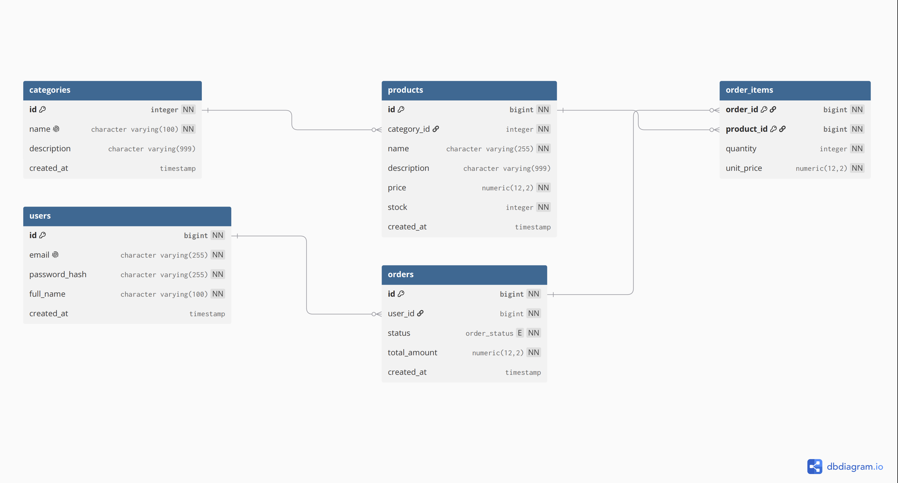

**2. Diagram Relasi Tabel (Bagian 2)**

**3. Diagram Relasi Tabel (Bagian 3)**
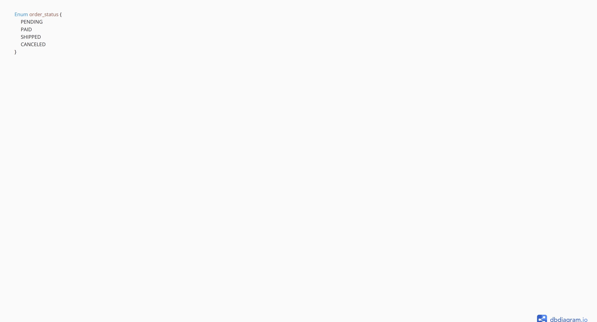

## 🗄️ Struktur Tabel
Skema ini mengimplementasikan desain relasional yang dinormalisasi dengan 5 tabel utama:

1. **`users`**: Entitas pengguna yang menggunakan kredensial email (dilindungi dengan algoritma *hash password*).
2. **`categories`**: Tabel *master* (referensi) untuk hierarki klasifikasi produk.
3. **`products`**: Entitas barang dagangan, dihubungkan secara spesifik ke tabel `categories` (Relasi 1:N). Menggunakan *constraint* `CHECK` untuk memastikan harga dan stok tidak bernilai negatif.
4. **`orders`**: Tabel *header* transaksi (Relasi 1:N dari `users`), memanfaatkan *custom type* ENUM untuk integritas status pesanan (`PENDING`, `PAID`, `SHIPPED`, `CANCELED`).
5. **`order_items`**: *Junction table* (Relasi M:N antara `orders` dan `products`). Menggunakan *Composite Primary Key* untuk mencegah duplikasi pemuatan produk yang sama dalam satu ID pesanan, serta menangkap data harga historis (*unit_price*) pada saat transaksi terjadi.

## ⚙️ Local Database Setup (PostgreSQL)
Untuk menjalankan dan menguji skema ini secara lokal pada komputer Anda, ikuti langkah berikut:

1. Buka aplikasi *database client* (seperti DBeaver atau pgAdmin).
2. Buat database lokal baru bernama `revoshop`.
3. Buka *SQL Editor* pada database `revoshop` tersebut.
4. Eksekusi file SQL dengan urutan yang ketat berikut:
   - Jalankan `schema.sql` untuk membangun seluruh tabel, *custom type*, dan batasan (*constraint*).
   - Jalankan `seed.sql` untuk memuat data sampel yang realistis ke dalam tabel.
5. Gunakan `queries.sql` untuk memverifikasi fungsionalitas dan logika ekstraksi data, yang secara khusus mendemonstrasikan hierarki penggunaan klausa `WHERE`, `ORDER BY`, dan `LIMIT`.

---

# CHECKPOINT 2

## Flask API & ORM Integration

Bagian ini mendemonstrasikan evolusi sistem dari eksekusi SQL mentah menjadi arsitektur *back-end* berbasis Python menggunakan **Flask**. Aplikasi telah direstrukturisasi ke dalam format yang modular dengan pemisahan yang jelas antara model database (`models.py`), jalur API (`routes.py`), dan konfigurasi (*app setup*). 

Interaksi database kini dikendalikan sepenuhnya melalui **SQLAlchemy ORM** dengan koneksi yang mengarah ke database `revoshop_db`. Selain itu, manajemen evolusi skema tabel (seperti penambahan kolom `role` pada tabel pengguna secara inkremental tanpa merusak data yang ada) dikelola dengan aman menggunakan **Flask-Migrate**.

### 🔗 API Testing Link
- **Postman Collection:** [https://web.postman.co/workspace/My-Workspace~ff8df842-4d12-48cf-86dd-d55ead636fe1/collection/57331440-d66dfa0a-4d06-4890-9f9e-0c63221f0ca9?action=share&source=copy-link&creator=57331440]

### 📸 Bukti Pengujian (Local Demo & Database Evidence)

**1. Demo Evidence**
*Tangkapan layar pengujian rute API berjalan secara lokal.*
- **Screenshot of POST Users**
  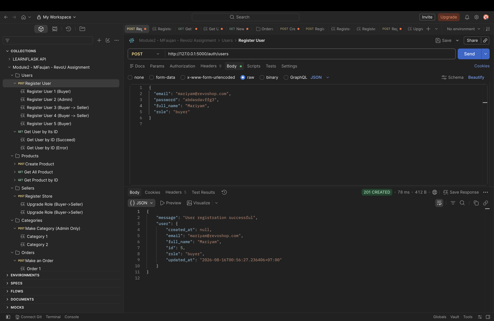
- **Screenshot of GET User by its ID**
  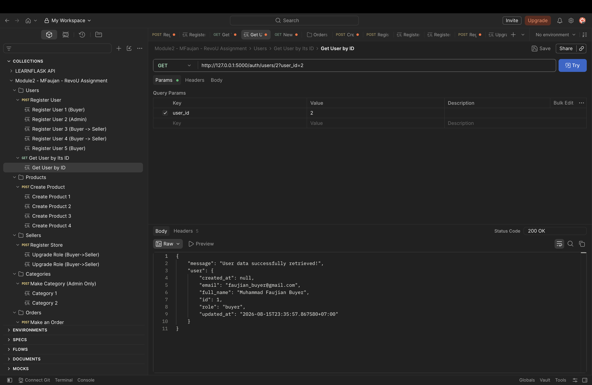
  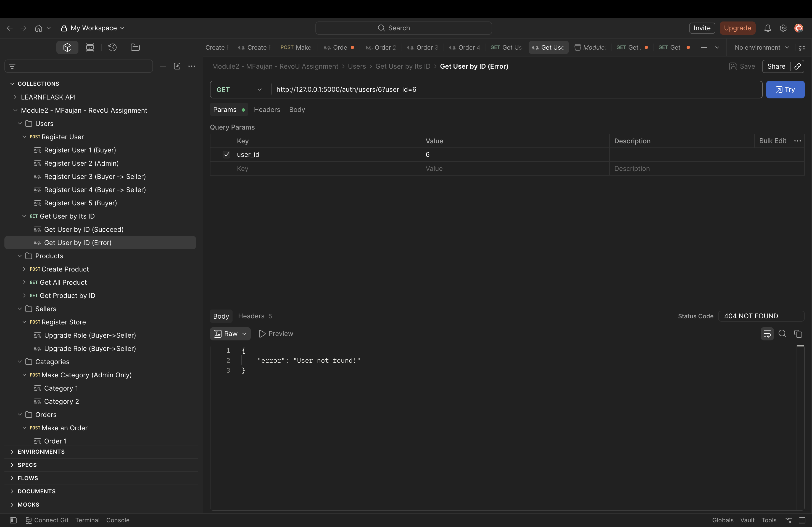
- **Screenshot of GET all products**
  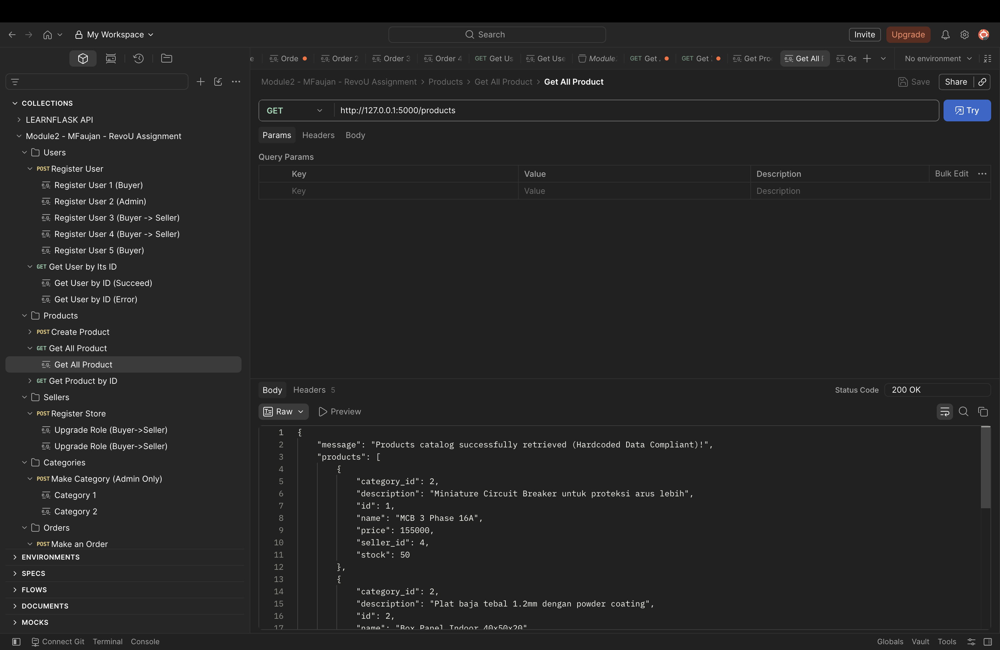
- **Screenshot of GET products by its ID**
  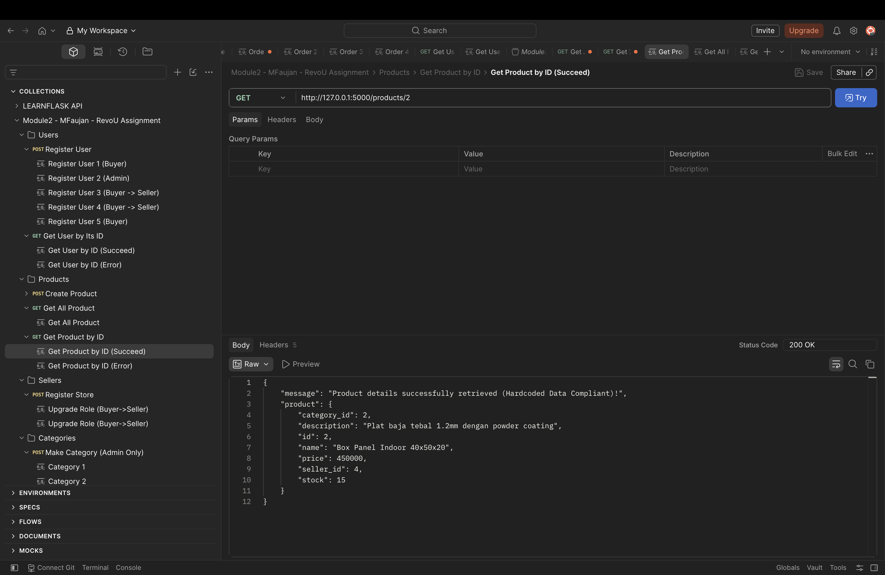
  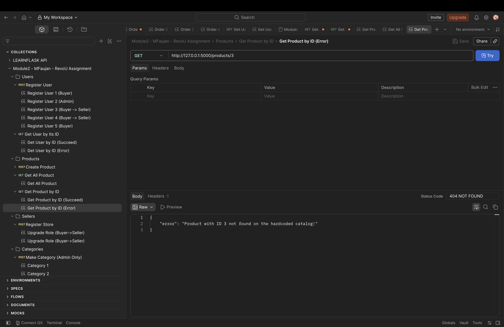

*(Catatan: Bukti pengujian untuk rute dan skenario lainnya secara lengkap tercantum dan dapat dilihat langsung melalui tautan Postman Workspace yang telah disertakan di atas).*

**2. DBeaver Evidence**
*Tangkapan layar validasi skema, relasi, dan hasil migrasi pada database.*
- **Screenshot Public Diagram**
  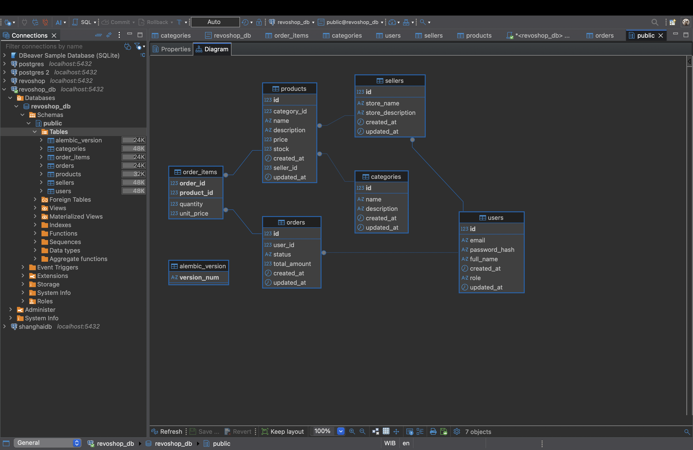
- **Screenshot Role Column**
  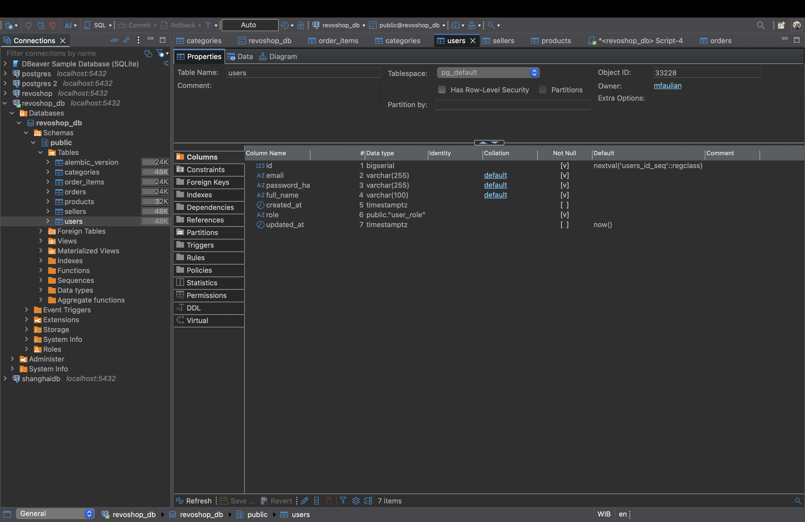
- **Screenshot Order_Items Diagram**
  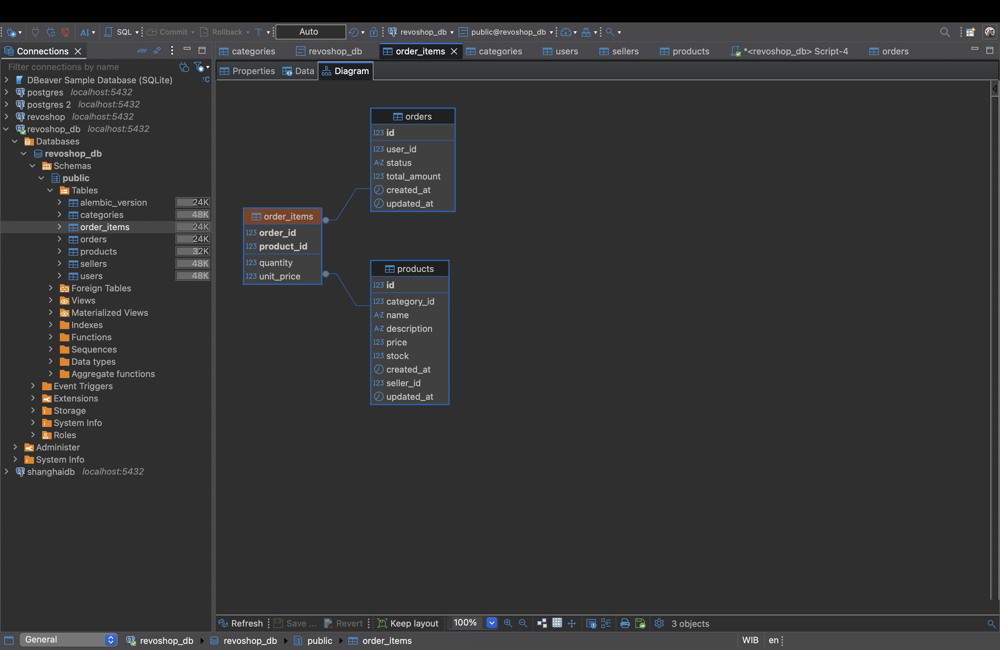
- **Screenshot Order_Items ForeignKey**
  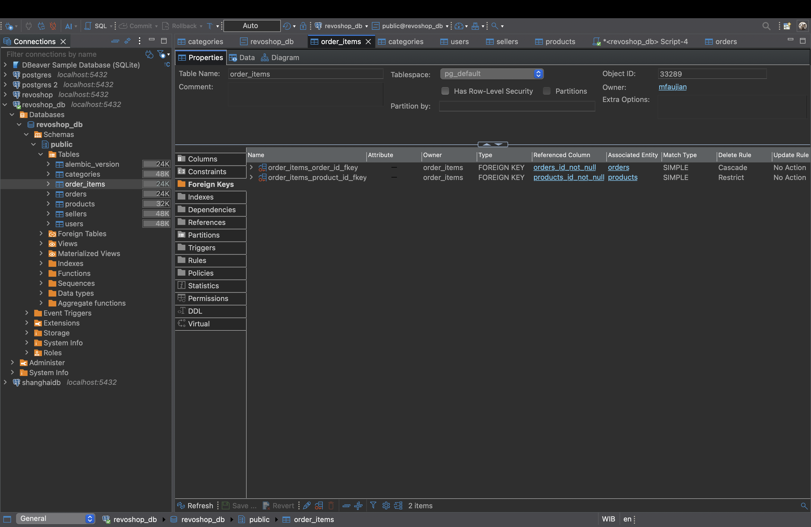

---

# CHECKPOINT 3